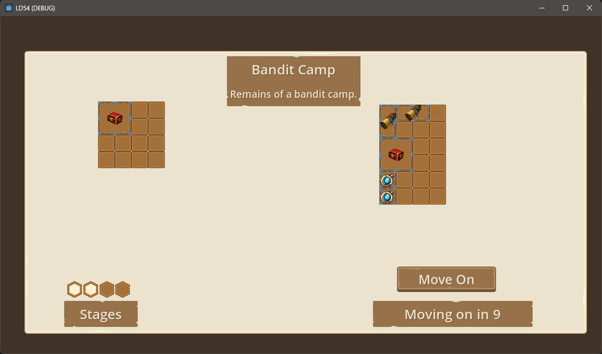

## Ludum Dare 54

> Limited Space

For Ludum Dare 54, I took limited space to a game of managing a limited inventory space, having to swap out items of differing values to maximise the space / value ratio in a limited time. 

The idea comes from the looting mechanics of loot & extract games like Escape From Tarkov. After a firefight, you have a limited time to loot the spoils, filling your bags with high value loot before moving on. 

I didn't submit the game but followed the rules of the jam when creating it, up to commit fb52460. Can be compiled and played in Godot. 

Ideas not completed:
  - Quest items that you must take
  - Items that you cannot move
  - Spaces that become locked and cannot be used
  - Multiple inventories of different sizes and limitations of their use
  - Combining items and score multipliers
  - More complex scenarios
    - Quests (must take an item until a later point)
    - Robbery (an item is removed)
    - Fights (see below)
  - Was also going to expand the idea of player health, weapons, armor and food / healing.

Credits:

- [Kenney.nl](https://kenney.nl) for the interface icons  
- [REXARD](https://assetstore.unity.com/publishers/13229) for the game icons
- [sfxr.net](https://sfxr.me/)